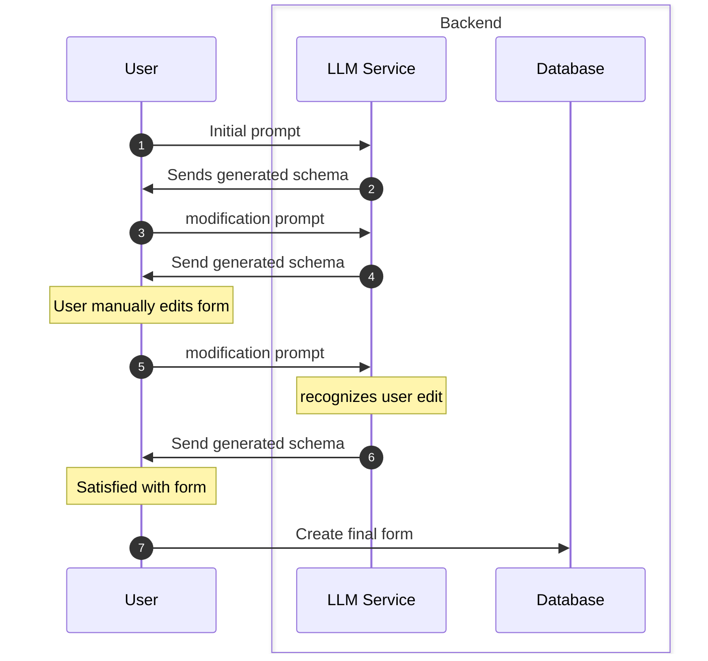
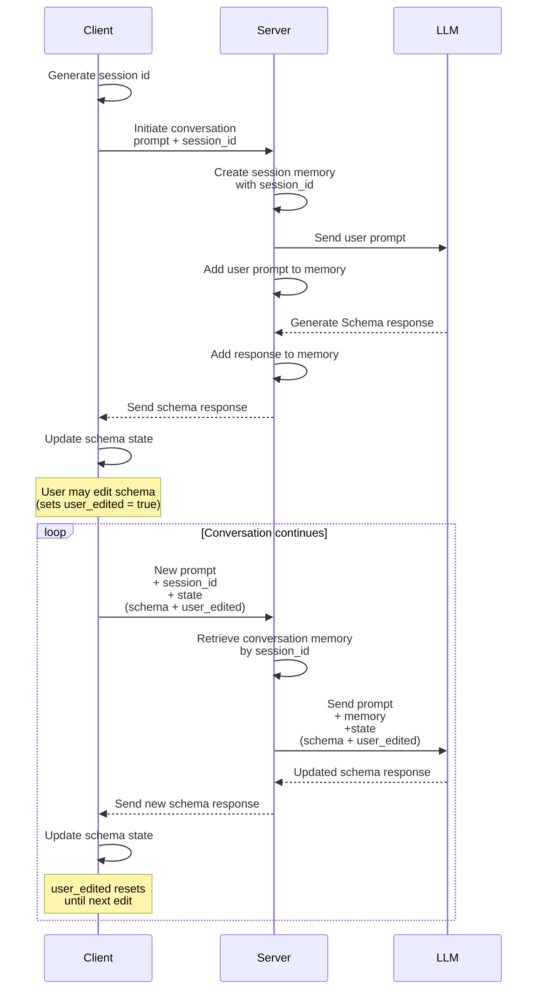

This is my first time writing a devlog. I'm writing this for you (the reader, and also my future self) to read through my raw thought process as I embark on building this project, and honestly, to finally kickstart my habit of writing and documenting my work.

<!--toc:start-->

- [The Idea](#the-idea)
- [The Plan](#the-plan)
    - [Data Model](#data-model)
    - [LLM Integration](#llm-integration)
- [The Project Structure](#the-project-structure)
- [Tech Stack](#tech-stack)
    <!--toc:end-->

## The Idea

LLM Assisted form building, use an LLM to generate a starter template for your form in seconds, just give it a prompt describing the purpose of your form and it gives you a ready to use form which you can edit or improve with iterative prompting.

I was inspired to build this by looking at a similar project [Instantforms](https://instantforms.co/), built by [Daniel Olabemiwo](https://www.danielolabemiwo.com/).

My goal for this project is not to compete with any existing products, in fact, I don't plan on making this into a SaaS. I believe there is so much to learn from building this project, I don't just want to sit and say "Hey, I can build that", I'm actually building it, to prove that I too can build.
So, yes, you can say that it's just a portfolio project. Sure, it would be cool if I can get a few people to use my tool, but I'll focus on treating this as a test of my technical prowess as a software engineer.

I would start small, at an atomic level, a simple basic version that I will continue to add things to later. My reason for this is that it would allow me focus on the core parts of the project, once I can confirm that the core parts are functional, it would be easier to build on top of it.

## The Plan

The most exciting part of the project for me is the LLM integration. Why? well, it's something I haven't really worked on before, at least not to a reasonable depth. My previous experience with LLM integration was Kwiki AI, an app that uses an LLM to generate study flashcards, It was pretty much plug and play, wire in the API, write a system prompt, and do some output validation, that was it.
I believe this project would require more than that, maybe not a whole lot, but it will definitely be a step forward.

Alright, let's get into it, I already know what a form is and how forms work, but:

- What does a form even look like in this application?
- How do I get an LLM to create a form?

I'll start from the first one, I think it's the most important question, because it asks "What exactly are we working with here?". So, let's define what exactly makes up a form in this project.

### Data Model

Let's consider both the form and response objects. Here is a rough idea of what these two might look like:

**Form table**:

| Field            | type     |
| ---------------- | -------- |
| form_id          | UUID     |
| user_id          | UUID     |
| form_title       | text     |
| form_description | text     |
| questions        | JSONb    |
| is_published     | boolean  |
| created_at       | datetime |
| updated_at       | datetime |

**Response table**

| Field       | type     |
| ----------- | -------- |
| response_id | UUID     |
| form_id     | UUID     |
| answers     | JSONb    |
| created_at  | datetime |

I'm storing the questions and answers directly as JSON into the database, instead of creating tables. Each question and answer is self-contained to a form, and there will be no need to access them outside the context of the form itself.

For questions and answers, here is what each one looks like for a single question or answer

**Question schema**

```json
// question with text answer type
{
  "question_id": 1, // I think there should be a way to make sure the questions maintain their order
  "question_text": "Lorem Ipsum",
  "answer_type": "text",
  "required": false
}

// question with select answer type
{
  "question_id": 1, // I think there should be a way to make sure the questions maintain their order
  "question_text": "Lorem Ipsum",
  "answer_type": "select",
  "answer_select_options": ["Yes", "No"],
  "answer_select_multiple": false,
  "required": false
}
```

For the initial stage, I have decided on keeping it lean, just two ways to answer, text, or selecting from a list of options. So a single schema to handle both cases should be enough for now.

**Answer schema**

```json
// response to text
{
    "question_id": 1,
    "answer_type": "text",
    "text_answer": "Dolor"
}

// response to select
{
    "question_id": 1,
    "answer_type": "select",
    "select_answer": ["Yes"]
}
```

What works now is having a unified schema with optional fields, to handle the different kinds of questions and responses.

Alright, this should answer the question

> What does a form even look like in this application?

Now that we have a data model and know exactly what we're working with, let's talk about how the LLM would fit into the system first.

### LLM Integration

I'm just trying to get a high level understanding of how this would work, so I'm going to abstract a lot of details, for example the LLM I would be using, the prompt structure, etc.

Here is the basic flow:

Pretty simple, a conversational session where the user can iterate with the LLM and even make manual edits which the LLM adds to the context.



I also had to figure out how to preserve the context of the session, how to make the LLM remember what it has generated, the user's prompts and also keep track of user edits.



The backend will handle the conversation memory for each session, this data doesn't need to be persisted in the database, so a temporary memory would fit, something like Redis. One more thing, sessions in memory are volatile, so what happens when the server loses memory mid session? Since each request from the client is carrying the current state, the conversation would continue from the last known client state.

For now, this is just a rough mental model of how I think the LLM integration will work, just enough to get started. Surely, I'll spot areas that need improvement along the way. The last thing I need is analysis paralysis trying to make the perfect plan.

At this point we have the answers to these two questions:

> How do I get an LLM to create a form?

> What does a form even look like in this application?

This concludes the plan at this stage, I'm very enthusiastic about working with the LLM and integrating it into the application, that's why I decided to explain it in detail.

Let's talk a little bit about the project structure now

## The Project Structure

I'll be splitting the project into two repositories, one for the backend and one for the frontend. I've worked this way before and it just keeps things cleaner.

## Tech Stack

FastAPI and PostgreSQL are my default choice for the backend.
I'll use Groq as my LLM provider, It has a really generous free tier with access to open source models.
For the actual LLM integration, Langchain comes to mind, it's a very popular choice for building agents. I'm looking to give it a try because it simplifies the process of building the kind of conversational LLM agent my project needs.
I'll also take this opportunity to learn Redis for its in memory database, exactly what I need to handle conversation session management.
The frontend is NextJS and Tailwind, straightforward choice.
