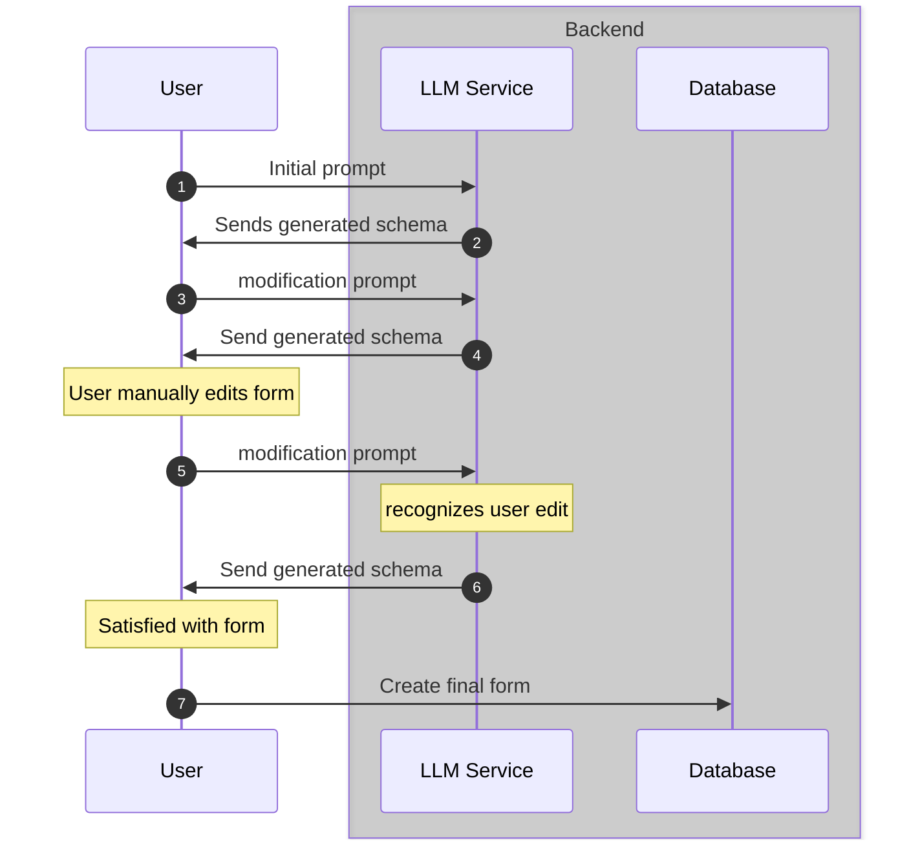
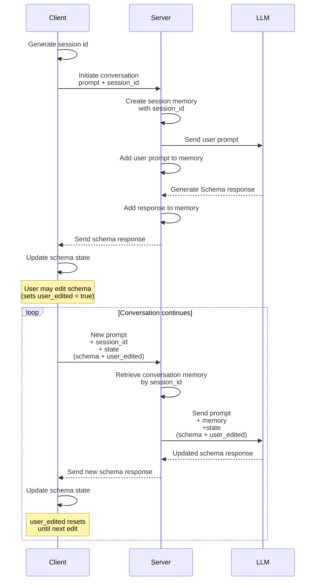

This is my first time writing a devlog. I'm writing this for you (the reader, and also my future self) to read through my raw thought process as I embark on building this project, and honestly, to finally kickstart my habit of writing and documenting my work.

## The Idea

LLM Assisted form building, use an LLM to generate a starter template for your form in seconds, just give it a prompt describing the purpose of your form and it gives you a ready to use form which you can edit or improve with iterative prompting.

I was inspired to build this by looking at a similar project [Instantforms](https://instantforms.co/), built by [Daniel Olabemiwo](https://www.danielolabemiwo.com/).

My goal for this project is not to compete with any existing products, in fact, I don't plan on making this into a SaaS. I believe there is so much to learn from building this project, I don't just want to sit and say "Hey, I can build that", I'm actually building it, to prove that I too can build.
So, yes, you can say that it's just a portfolio project. Sure, it would be cool if I can get a few people to use my tool, but I'll focus on treating this as a test of my technical prowess as a software engineer.

I would start small, at an atomic level, a simple basic version that I will continue to add things to later. My reason for this is that it would allow me focus on the core parts of the project, once I can confirm that the core parts are functional, it would be easier to build on top of it.

## El plan

The most exciting part of the project for me is the LLM integration. Why? well, it's something I haven't really worked on before, at least not to a reasonable depth. My previous experience with LLM integration was Kwiki AI, an app that uses an LLM to generate study flashcards, It was pretty much plug and play, wire in the API, write a system prompt, and do some output validation, that was it.
I believe this project would require more than that, maybe not a whole lot, but it will definitely be a step forward.

Alright, let's get into it, I already know what a form is and how forms work, but:

- "How do I get an LLM to create a form?"
- "How would a user create a form manually?"
- "What does a form even look like in this application?"

That third question should have been the first one, I think it's the most important question, because it asks "What exactly are we working with here?". So, let's define what exactly makes up a form in this project.

### Data Model

Initially, I was thinking of some sort of schema, that the LLM can understand, while the frontend converts that schema into components, but how about the reverse? How does the frontend convert a visual form into this schema? Perhaps we could have each form element (question) as components, and as the user creates questions on the frontend UI, these components could be arranged in a stack, and by some typescript wizardry, each component is converted to it's schema equivalent, making it so that we can construct the same schema and send it to the backend.

So, at this point, we have established that a form will have a schema, this schema just holds the questions as JSON, because I don't think there is any need to create a table for questions. The same will apply for responses, a response will have a schema to hold the answers.

Here is a rough idea of what these two might look like

**Form table**:

| Entity           | type     |
| ---------------- | -------- |
| form_id          | UUID     |
| user_id          | UUID     |
| form_title       | text     |
| form_description | text     |
| questions        | JSONb    |
| is_published     | boolean  |
| created_at       | datetime |
| updated_at       | datetime |

**Response table**

| Entity      | type     |
| ----------- | -------- |
| response_id | UUID     |
| form_id     | UUID     |
| answers     | JSONb    |
| created_at  | datetime |

I'm storing the questions and answers schemas directly as JSON into the database, instead of creating tables. Each question and answer is self-contained to a form, and there will be no need to access them outside the context of the form itself.

For questions and answers schemas, here is what each one looks like for a single question or answer

**Question schema**

```json
// question with text answer type
{
  "question_id": 1, // I think there should be a way to make sure the questions maintain their order
  "question_text": "Lorem Ipsum",
  "answer_type": "text",
  "required": false
}

// question with select answer type
{
  "question_id": 1, // I think there should be a way to make sure the questions maintain their order
  "question_text": "Lorem Ipsum",
  "answer_type": "select",
  "answer_select_options": ["Yes", "No"],
  "answer_select_multiple": false,
  "required": false
}
```

For the initial stage, I have decided on keeping it lean, just two ways to answer, text, or selecting from a list of options. So a sinlge schema to handle both cases should be enough for now.

When rendering a question, the answer type determines what kind of input field to display under the question text, for text question it's very straightforward, a simple text field, the extra schema fields can be ignored if the answer_type is text. If the answer_type is select, a checkbox list is displayed with the options in answer_select_options, in this case all fields are used.

**Answer schema**

```json
// response to text
{
    "question_id": 1,
    "answer_type": "text",
    "text_answer": "Dolor"
}

// response to select
{
    "question_id": 1,
    "answer_type": "select",
    "select_answer": ["Yes"]
}
```

It looks weird, but until I can find a better solution, what works now is a having a unified schema with optional fields.

Alright, this should answer the question

> "What does a form even look like in this application?

Now that we have a data model and know exactly what we're working with, let's talk about how the LLM would fit into the system first.

### LLM Integration

I'm just trying to get a high level understanding of how this would work, so I'm going to abstract a lot of details, for example the LLM I would be using, the prompt structure, etc.

Here is the basic flow:



Pretty simple, a conversational session where the user can iterate with the LLM and even make manual edits which the LLM adds to the context.

I also had to figure out how to preserve the context of the session, how to make the LLM remember what it has generated, the user's prompts and also keep track of user edits.



The backend will handle the conversation memory for each session, this data doesn't need to be persisted in the database, so a temporary memory would fit, something like Redis. One more thing, sessions in memory are volatile, so what happens when the server loses memory mid session? Since each request from the client is carrying the current state, the conversation would continue from the last known client state.

That pretty much covers my high level overview of the LLM integration, this is merely just a rough sketch, things might change once I dive into the actual integration. This LLM section also answers the first question I asked myself earlier:

> "How do I get an LLM to create a form?"
